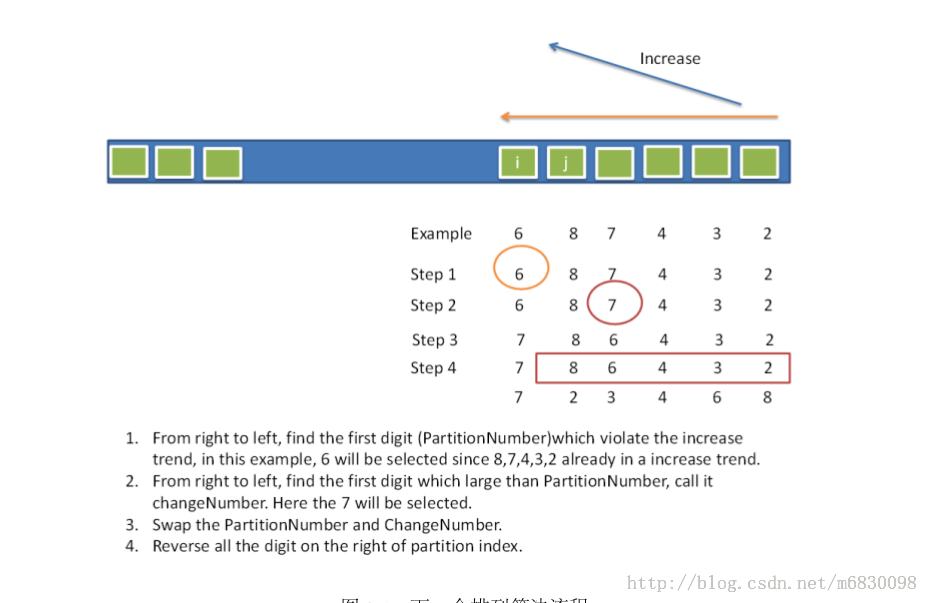

#Next Permutation

[原題連結](http://www.lintcode.com/en/problem/next-permutation/)

題意：給定一排列，找出它的下一個

解題思路：

一開始也不知怎作，但網上有個演算法如下：
1. 由後往前找到第一個 $$i$$ ，使得 ```A[i] < A[i+1]```
2. 從陣最最後一位一直搜尋到 $$i+1$$ ，找出一個 $$j$$ ，使得 ```A[j] > A[i]```，將兩者交換
3. 接著將 ```sort(A, i + 1, A.length - 1)```。

網友 **水中的魚** 提供了下面精美的圖：



程式碼如下：

```java
public class Solution {
    /**
     * @param nums: an array of integers
     * @return: return nothing (void), do not return anything, modify nums in-place instead
     */
    public int[] nextPermutation(int[] nums) {
        
        if (nums == null || nums.length < 2) {
            return nums;
        }
        
        int len = nums.length;
        int pivot = -1;
        for (int i = len - 2; i >= 0; i--) {
            if (nums[i] < nums[i + 1]) {
                pivot = i;
                break;
            }
        }
        
        // 這題難在如何處理邊際條件
        // 如果pivot等於-1的話，代表目前的排列為降序，且是最後一個排列，
        // 若不等於-1，則代表pivot右邊至少存在一數比pivot大，找到它並與pivot交換
        // 此作法是把pivot的右側調整為降序
        if (pivot != -1) {
            for (int i = len - 1; i > pivot; i--) {
                if (nums[i] > nums[pivot]) {
                    swap(nums, i, pivot);
                    break;
                }
            }
        }
        
        // 把pivot的右邊作翻轉(即排成升序)即可，因pivot的右邊為降序
        reverse(nums, pivot + 1, len - 1);
        
        return nums;
    }
    
    private void swap (int[] A, int a, int b) {
        int temp = A[a];
        A[a] = A[b];
        A[b] = temp;
    }
    
    private void reverse(int[] A, int start, int end) {
        while (start < end) {
            int temp = A[start];
            A[start] = A[end];
            A[end] = temp;
            start++;
            end--;
        }
    }
}

```

>Time Complexity：$$O(N)$$

---
###Reference

1. http://fisherlei.blogspot.com/2012/12/leetcode-next-permutation.html
2. http://blog.csdn.net/m6830098/article/details/17291259